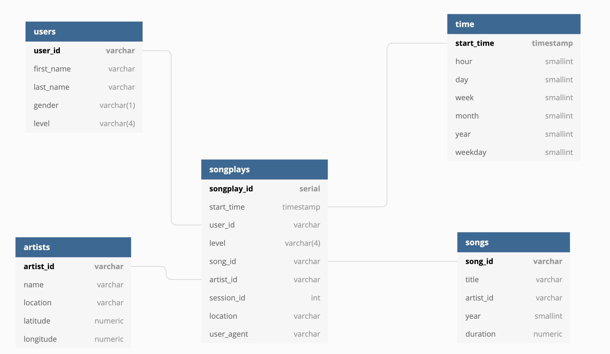
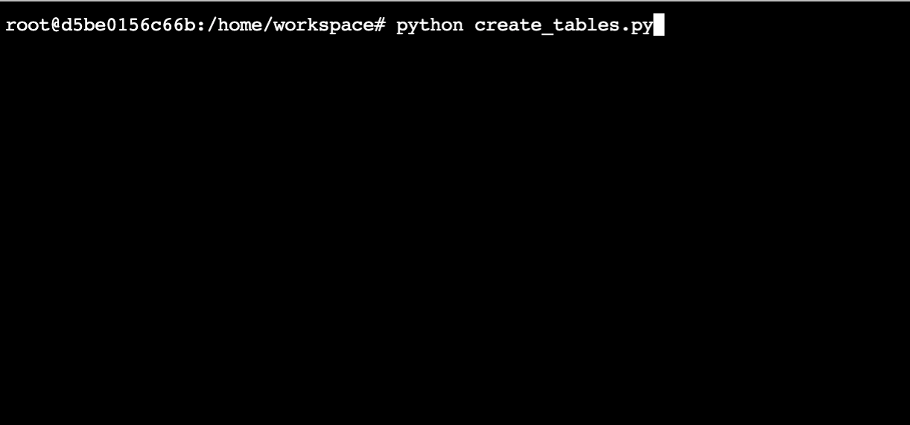
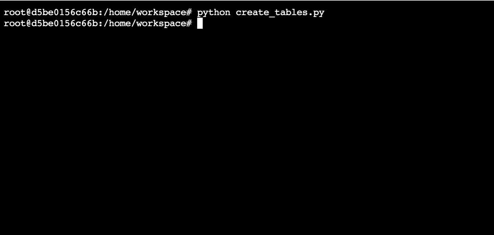
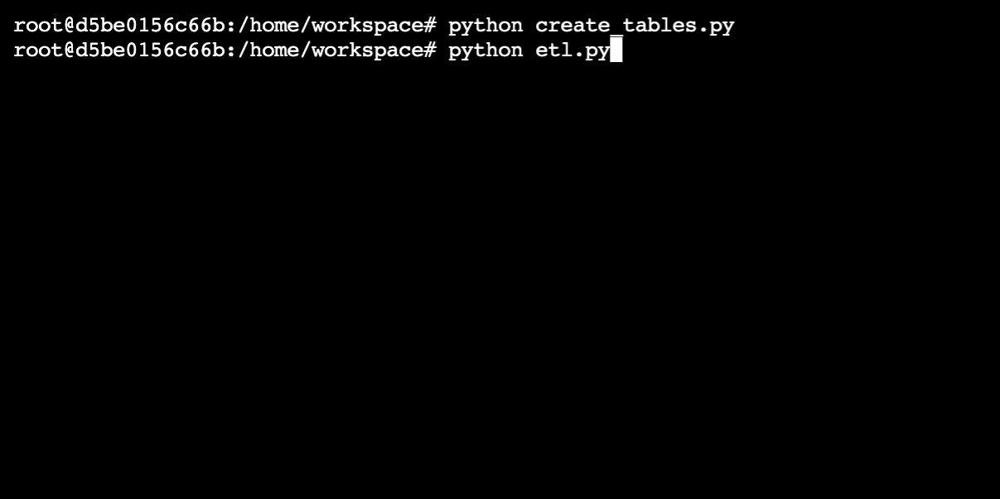
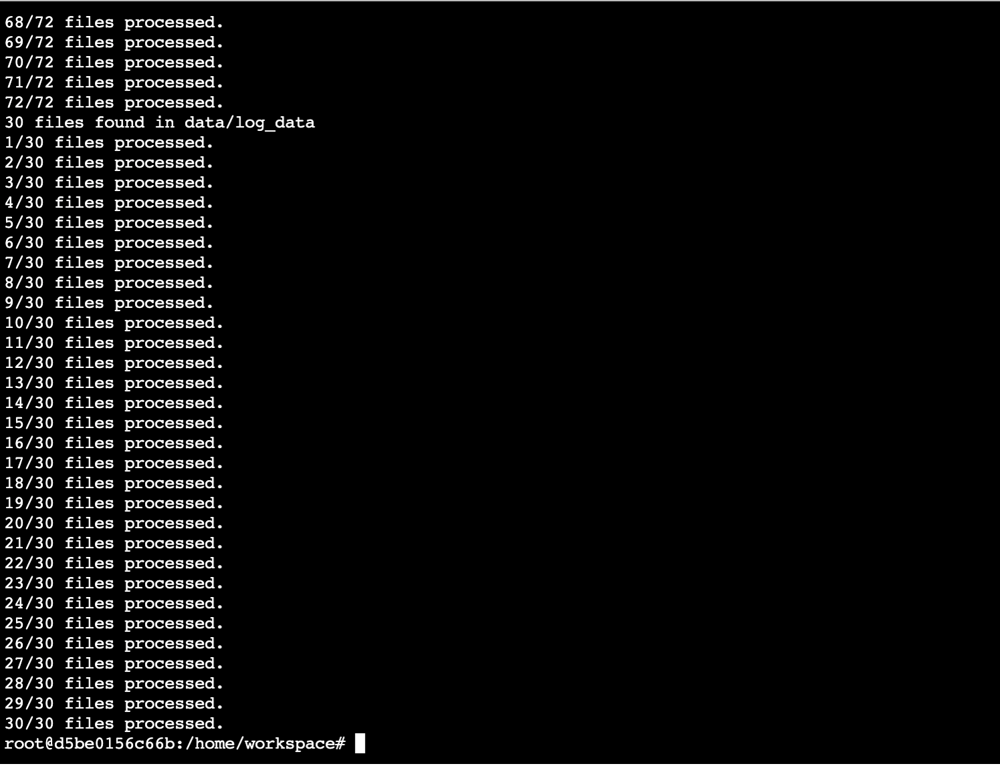

<h2>Project Overview</h2>

This project is implemented for Sparkify to be able to easily query and perform analytical research upon the song data obtained from their music streaming application. The database schema and the ETL pipeline were implemented carefully as we will be handling millions of data. The processes of creating schemas and running the pipeline can be carried out efficiently just by executing a few scripts.

<h2>Files Included</h2>

<ol>
    <li><code>create_tables.py</code> - CREATE TABLE queries are written here and it is essential to run this script before any other scripts.</li>
    <li><code>sql_queries.py</code> - All database queries reside inside this file.</li>
     <li><code>etl.py</code> - All ETL pipeline operations are written here and this must only be run after the database tables had been created.</li>
     <li><code>data (directory)</code> - The logs and song data files can be found here.</li>
</ol>

<h2>Database Schema Design</h2>

The database for this project is structured with the star schema which is a database organizational structure that promotes fast database reads and is optimal for dealing with large amounts of data. As a music streaming app with decent amount of users, there will be a lot of data logged daily. Here, with the optimized use of the star schema, we can perform several analysis upon our data in an efficient way without needing to perform complex JOINS across multiple tables. We will have a centralized fact table which will reference data from the dimension tables which makes it easier to retrieve data depending on our business needs.
The data is structured as follows:

 
As you can see above, our data structure contains 5 tables: <strong>songplays</strong>, <strong>users</strong>, <strong>songs</strong>, <strong>artists</strong> and <strong>time</strong> with <strong>songplays</strong> table being a fact table referencing data from the others four which are dimension tables. Appropriate primary  keys are added to reduce data duplications with fallback actions to perform if conflicts occur. Not only that, data types for each of the column fields are carefully considered to save memory.

<h2>ETL Pipeline</h2>

The entirety of the ETL process is written inside <code>etl.py</code> script. It is a two-part process and upon running the script, the song data will be processed first and then the user logs will be proccessed. Both the song and log data can be found within the <code>data</code> directory and the data files should be in a valid JSON format.

<h2>How To Run</h2>

- Open the terminal.
- Navigate to the project folder by entering <code>cd path-to-the-project</code> in the terminal.
- Type <code>python create_tables.py</code> in the terminal to execute the script and create the tables.  

- Doing will DROP all the existing tables so, make sure that you have backed up your data before executing the script.
- It would only take a few seconds and you can tell the process is done when the cursor box reappears like in the picture below:

- Next, type <code>python etl.py</code> to run the ETL pipeline.

- Song data residing in the data directory will be processed first and you can see each step of the process as shown here: 

- Log data will be processed after all song data have been proccessed.
- If the whole process is executed without any error, the data is successfully loaded into the database.

<h2>Technologies Used</h2>

<ul>
<li>
 
[pandas](https://pandas.pydata.org/) - Data analysis library for Python

</li>
    
<li>
    
[psycopg2](https://www.psycopg.org/) - Postgres database adapter for Python
    
</li>
</ul>
